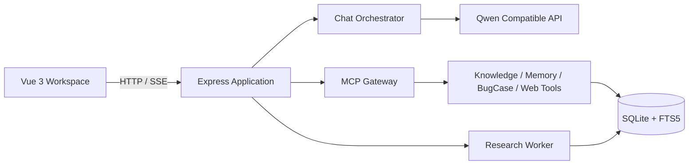

<p align="center">
  
</p>

# Matthew's Workspace

> 一个前端主导的 AI Agent 工作台：让对话、资料证据、长期记忆与深度研究在同一套可解释流程中协作。

Matthew's Workspace 基于 Vue 3、TypeScript、Express、MCP 和 SQLite 构建。它关注的不是把模型回答直接展示出来，而是让用户能够看到：本轮回答使用了哪些上下文、资料是否真的被检索并采纳、长期记忆是否经过确认，以及研究任务的来源与进度。

## 核心能力

### 对话与上下文可视化

- 基于 `fetch + ReadableStream + TextDecoder` 的 SSE 流式回答。
- 会话、消息、取消和运行状态由独立 Chat module 管理。
- 每条回答可展开查看本轮上下文、工具调用、耗时、token 与运行诊断。

### 资料库与证据优先 RAG

- 支持多个资料库和会话级资料范围；范围由服务端执行，不能被模型或客户端参数绕过。
- 支持 `.md`、`.markdown`、`.txt`、`.json` 文档，按标题、段落和代码围栏分块。
- 使用 SQLite FTS5/BM25 与向量候选的 RRF 融合；Embedding 不可用时降级为关键词检索。
- 已选择资料范围时，服务端先进行受控检索；仅通过证据准入的资料片段才会进入回答上下文。

### 可审查长期记忆

- 记忆分为 `profile / preference / fact / event / pitfall` 五类。
- 候选需经过敏感信息过滤和重复检查，并等待人工确认、纠正或拒绝。
- 只有 `confirmed / corrected` 的相关记录才可能参与后续上下文装配。

### 深度研究与 BugCase

- 深度研究任务具备持久化阶段、恢复、取消、重试、来源和报告校验。
- 支持本地资料、受控联网或混合研究；未配置联网 provider 时会明确降级。
- BugCase 将症状、上下文、修复、验证和审核状态作为结构化知识管理，并区分项目范围与公共案例。

## 一分钟体验路径

1. 创建资料库并上传 Markdown 或文本资料。
2. 等待文档完成索引后发布它，再在对话中选择该资料范围。
3. 开启 RAG 提问，随后展开回答详情查看资料取证与引用。
4. 在记忆中心确认有长期价值的候选信息。
5. 将需要多步查证的问题转为深度研究任务，查看进度、来源和报告。

## 架构概览



## 当前边界

- 当前支持文本资料；PDF、网页采集和 OCR 仍是后续方向。
- 当前为单工作区、单 Node 服务实例，尚未提供多用户鉴权或分布式 worker。
- 联网搜索仅由深度研究在服务端受控调用；需要配置实际 provider 才会启用。
- 不提供 Coding Agent、任意文件写入或 shell 执行能力。

## 本地启动

要求：Node.js `>= 22.13.0`，以及可用的 Qwen OpenAI-compatible API Key。

```bash
npm install
cp .env.example .env.local
```

在 `.env.local` 中至少配置：

```bash
QWEN_API_KEY=your_api_key
```

启动开发环境：

```bash
npm run dev
```

默认访问地址为 `http://127.0.0.1:5173`。前端和 Express 服务会同时启动；服务端默认端口为 `8787`。

## 技术栈

| 层级 | 技术 |
| --- | --- |
| Frontend | Vue 3, Vite, TypeScript, Pinia |
| Backend | Node.js, Express, SSE |
| Agent | MCP, Function Calling, Qwen OpenAI-compatible API |
| Storage & Retrieval | SQLite, FTS5/BM25, Embedding, RRF |
| Quality | Node Test Runner, Vitest, TypeScript Build |

## 开发检查

```bash
npm test
npm run test:client
npm run build
```

项目内的详细设计文档、学习笔记和本地评测语料与公开 README 分开维护，避免把历史方案或未验证资料误写成当前能力。
