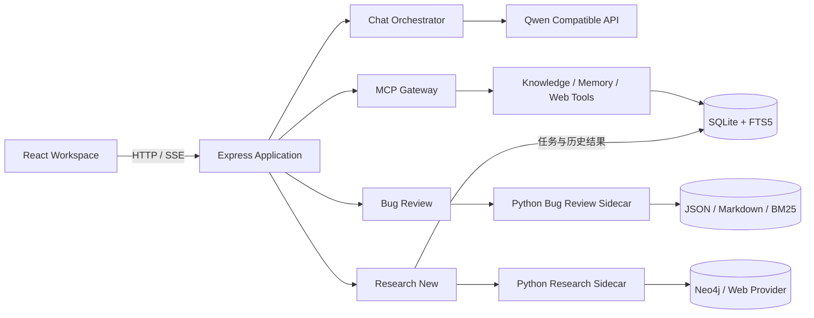

<p align="center">
  
</p>

# Matthew's Workspace

> 一个前端主导的 AI Agent 工作台：让对话、资料证据、长期记忆与深度研究在同一套可解释流程中协作。

Matthew's Workspace 基于 React、TypeScript、Express、MCP 和 SQLite 构建。它关注的不是把模型回答直接展示出来，而是让用户能够看到：本轮回答使用了哪些上下文、资料是否真的被检索并采纳、长期记忆是否经过确认，以及研究任务的来源与进度。

## 核心能力

### 对话与上下文可视化

- 基于 `fetch + ReadableStream + TextDecoder` 的 SSE 流式回答。
- 会话、消息、取消和运行状态由独立 Chat module 管理。
- 每条回答可展开查看本轮上下文、工具调用、耗时、token 与运行诊断。

### 资料库与证据优先 RAG

- 支持多个资料库和会话级资料范围；范围由服务端执行，不能被模型或客户端参数绕过。
- 支持 `.md`、`.markdown`、`.txt`、`.json` 文档，按标题、段落和代码围栏分块。
- 使用 SQLite FTS5/BM25 与向量候选的 RRF 融合；Embedding 不可用时降级为关键词检索。
- 已选择资料范围时，服务端先进行受控检索；仅通过证据准入的资料片段才会进入回答上下文。

### 可审查长期记忆

- 记忆分为 `profile / preference / fact / event / pitfall` 五类。
- 候选需经过敏感信息过滤和重复检查，并等待人工确认、纠正或拒绝。
- 只有 `confirmed / corrected` 的相关记录才可能参与后续上下文装配。

### 深度研究与 Bug 复盘

- 深度研究使用单一工作台入口，展示任务状态、报告、来源与交付检查；Python Sidecar 承载参考项目研究链路。
- 当前可研究知识库或联网资料；知识库默认使用关键词与向量检索，GraphRAG 为实验选项。知识库与联网联合研究、逐句语义核验尚未完成。
- Bug 复盘支持手动导入已合入的 GitHub PR，保留 PR、diff、讨论及 CI 等材料，经 Qwen 生成、人工编辑审核后发布；案例库只检索已发布快照，证据不完整的案例持续显示缺口。

## 一分钟体验路径

1. 创建资料库并上传 Markdown 或文本资料。
2. 等待文档完成索引后发布它，再在对话中选择该资料范围。
3. 开启 RAG 提问，随后展开回答详情查看资料取证与引用。
4. 在记忆中心确认有长期价值的候选信息。
5. 将需要多步查证的问题转为深度研究任务，查看进度、来源和报告。
6. 在 Bug 复盘中导入已合入 PR，核对来源和推断、补充缺口，再审核发布并搜索修复经验。

## 架构概览


```mermaid
flowchart LR
  UI[React Workspace] -->|HTTP / SSE| API[Express Application]
  API --> CHAT[Chat Orchestrator]
  API --> MCP[MCP Gateway]
  CHAT --> MODEL[Qwen Compatible API]
  MCP --> TOOLS[Knowledge / Memory / Web Tools]
  TOOLS --> DATA[(SQLite + FTS5)]
  API --> BUG[Bug Review]
  BUG --> BUGPY[Python Bug Review Sidecar]
  BUGPY --> CASES[(JSON / Markdown / BM25)]
  API --> RESEARCH[Research New]
  RESEARCH --> PY[Python Research Sidecar]
  PY --> GRAPH[(Neo4j / Web Provider)]
  RESEARCH -->|任务与历史结果| DATA
```

## 当前边界

- 当前支持文本资料；PDF、网页采集和 OCR 仍是后续方向。
- 当前为单工作区、单 Node 服务实例，尚未提供多用户鉴权或分布式 worker。
- 联网搜索仅由深度研究在服务端受控调用；需要配置实际 provider 才会启用。
- 不提供 Coding Agent、任意文件写入或 shell 执行能力。
- Bug 复盘为单人审核 Demo，生成结果需要核对；引用可追溯不等于根因已被证实。未接入 GitHub webhook、自动修复或 Chat 检索；私有 PR 与更多真实样本仍待验收。旧 Bug API 返回 410，旧 SQLite 数据保留，不自动迁移。

## 本地启动

要求：Node.js `>= 22.13.0`，以及可用的 Qwen OpenAI-compatible API Key。

```bash
npm install
cp .env.example .env.local
```

在 `.env.local` 中至少配置：

```bash
QWEN_API_KEY=your_api_key
```

启动开发环境：

```bash
npm run dev
```

默认访问地址为 `http://127.0.0.1:5175`。前端和 Express 服务会同时启动；服务端默认端口为 `8787`。上述命令不会启动 Python Sidecar；深度研究需要单独启动 Sidecar，或使用下方的联合启动命令。早期 Node 研究引擎保存在 `server/modules/research-new/oldVersion/`，不接入主服务。

要体验参考项目迁入的 Sidecar 研究链路，先按 [Research Sidecar 启动说明](services/research-sidecar/README.md) 准备 Python 环境、模型／搜索配置及所需的 Neo4j，再运行：

```bash
npm run dev:with-research-sidecar
```

该命令并列启动前端、Express 和 Sidecar，并将新建研究任务路由到 Sidecar；它不会自动启动 Neo4j。当前 GraphRAG 仅支持已建图的单个资料库，知识库与联网联合研究尚未实现。

Bug 复盘需按 [Bug Review Sidecar 启动说明](services/bug-review-sidecar/README.md) 准备独立 Python 环境，然后运行：

```bash
npm run dev:with-bug-review-sidecar
```

默认使用现有 Qwen 配置；私有仓库凭据仅留在后端。该命令不启动 Research Sidecar，两个模块的存储与任务相互独立。

## 技术栈

| 层级 | 技术 |
| --- | --- |
| Frontend | React, Vite, TypeScript, TanStack Query, Zustand |
| Backend | Node.js, Express, SSE |
| Agent | MCP, Function Calling, Qwen OpenAI-compatible API |
| Storage & Retrieval | SQLite, FTS5/BM25, Embedding, RRF |
| Quality | Node Test Runner, Vitest, TypeScript Build |

## 开发检查

```bash
npm test
npm run test:client
npm run build
```

项目内的详细设计文档、学习笔记和本地评测语料与公开 README 分开维护，避免把历史方案或未验证资料误写成当前能力。
